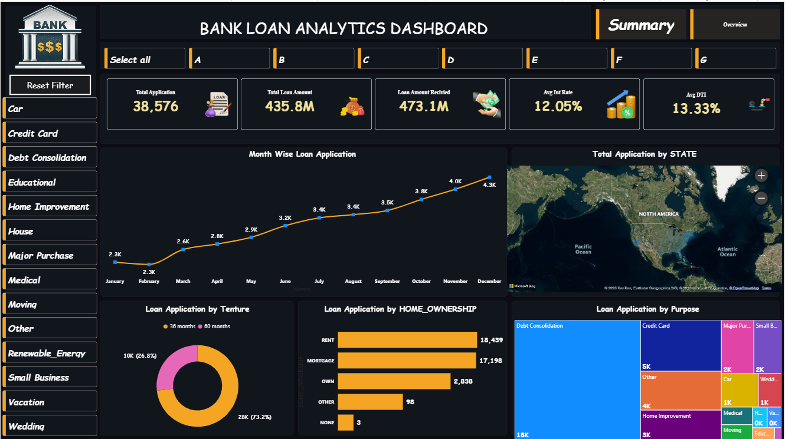
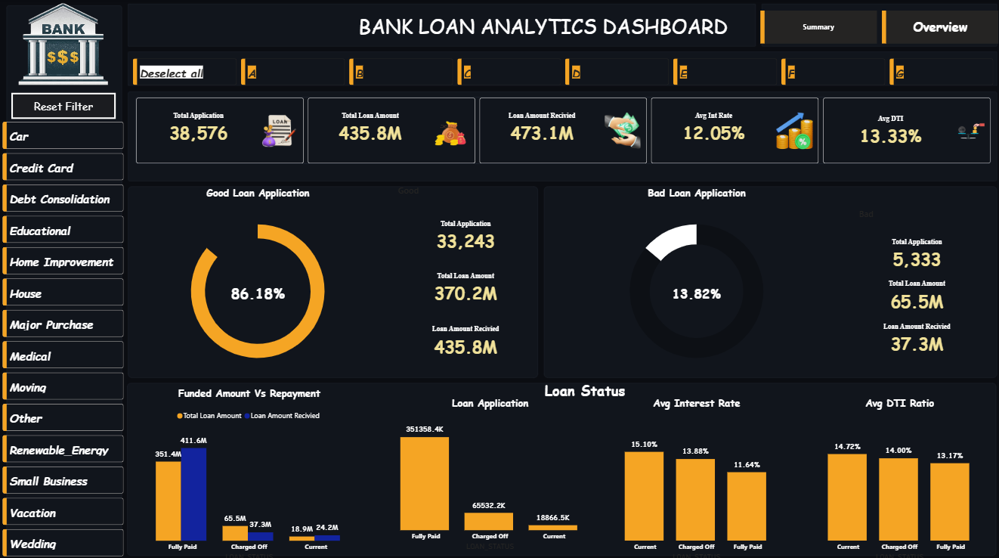

# Bank Loan Analytics Dashboard (Power BI)

 **Project Overview**

This project presents an interactive Power BI dashboard for analysing bank loan performance. It provides insights into loan applications, funded amounts, repayments, interest rates, DTI ratio, loan status, and customer behaviour.

**Dashboard Pages**

 **1. Summary Dashboard**

- Total Loan Applications
- Total Loan Amount
- Loan Amount Received
- Average Interest Rate
- Average DTI
- Monthly Loan Applications
- State-wise Loan Distribution
- Home Ownership Analysis
- Loan Purpose Analysis
- Loan Tenure Analysis

 **2. Overview Dashboard**
 
- Good Loan vs Bad Loan
- Funded Amount vs Repayment
- Loan Status
- Interest Rate Analysis
- DTI Ratio Analysis

 **KPIs**

- Total Loan Applications
- Total Loan Amount
- Loan Amount Received
- Average Interest Rate
- Average DTI

 **Tools Used**

- Power BI
- Power Query
- DAX
- Microsoft Excel
- SQL

 **Dataset**

The dataset contains customer loan information including:

- Loan Amount
- Loan Status
- Interest Rate
- Purpose
- Home Ownership
- State
- Term
- DTI
- Funded Amount

 **Project Features**

- Interactive Filters
- KPI Cards
- Donut Charts
- Bar Charts
- Treemap
- Map Visual
- Line Chart
- Loan Performance Analysis

## Dashboard Preview

### Overview

### Summary

---

Done By:
Vinoth.M
lINKEDIN URL : www.linkedin.com/in/m-vinoth-1326122b4
